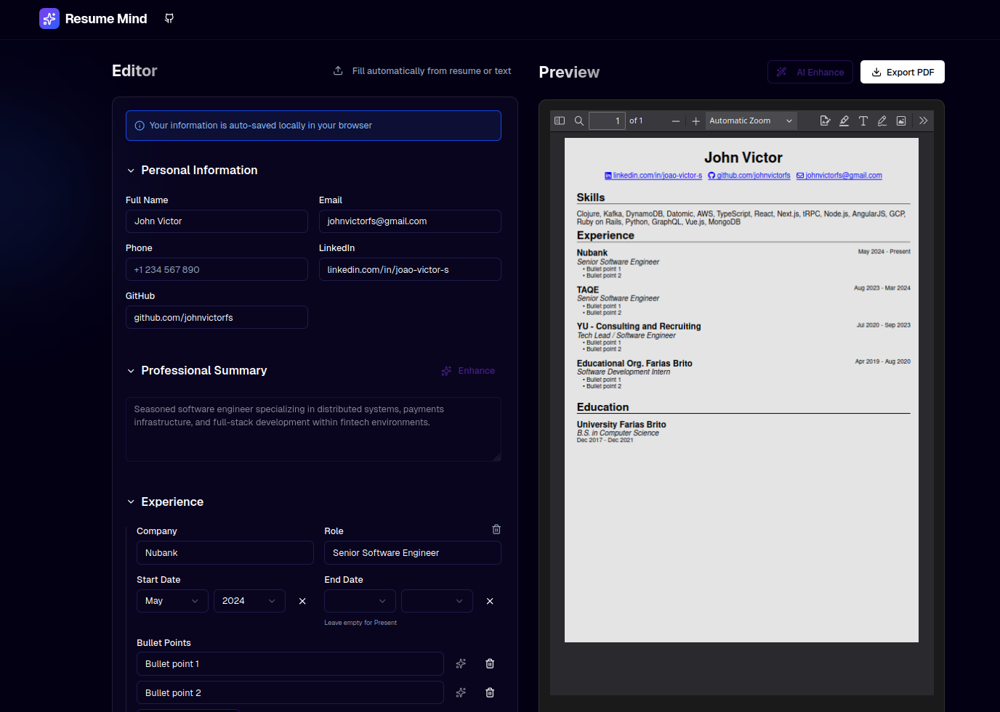

# Resume Mind

> [!NOTE]  
> AI features are currently work-in-progress. For now, only importing text to pre-generate a form and PDF is functional.

Create or upgrade your Resume with a user-friendly interface, with the optional help of AI.



## Run with Docker compose

```bash
# By default it will be available at https://localhost:3000
# Edit docker-compose.yaml to change the exposed port
docker compose up -d
```

## Development

- Requirements

  - [bun](https://bun.sh)

- Setup

  ```bash
  # Install dependencies
  bun install

  # Setup environmant variables in .env file
  cp .env.example .env # then edit with prefered editor

  # Setup the database
  bun db:push
  ```

- Start dev server

  ```bash
  bun dev
  ```

## Stack

If you are not familiar with the different technologies used in this project, please refer to the respective docs.

- [React-pdf](https://react-pdf.org)
- [Next.js](https://nextjs.org)
- [Better auth](https://www.better-auth.com)
- [Drizzle](https://orm.drizzle.team)
- [Tailwind CSS](https://tailwindcss.com)
- [tRPC](https://trpc.io)

---

This is a [T3 Stack](https://create.t3.gg/) project bootstrapped with `create-t3-app`.
